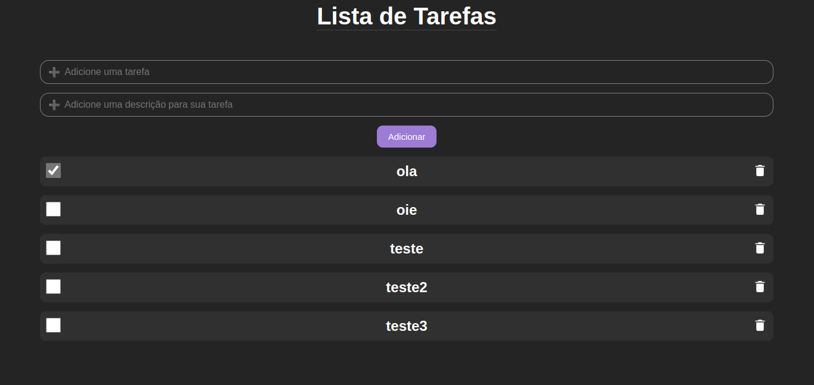
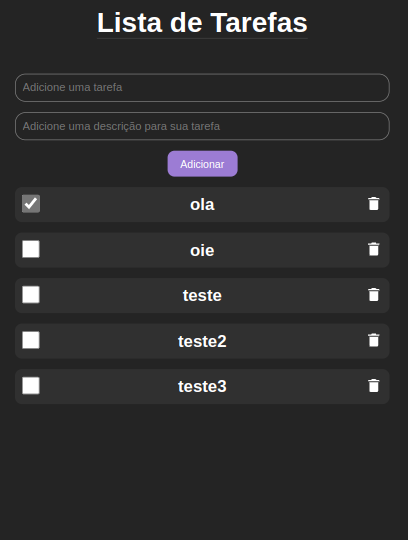
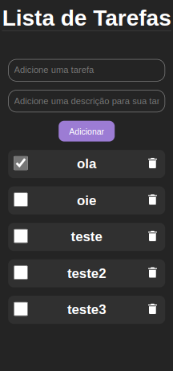

<h1 align="center">TodoList FullStack</h1>

  

    
  

  

   
  
  

    
  

  

   
  
  

    
  

<h1 align="center">:sparkles: Tecnologias</h1>

Esse projeto foi desenvolvido com</h1>
 

<a href="https://reactjs.org/">ReactJs</a>

<a href="https://nodejs.org/en/">NodeJs</a>

<a href="https://www.mysql.com/">MySql</a>

<a href="https://expressjs.com/pt-br/">Express</a>

<a href="https://www.typescriptlang.org/">Typescript</a>

 

<h1 align="center">:computer: Sobre o Projeto</h1>

Projeto simples de TodoList FullStack, com finalidade para estudos. Esse projeto consegue cadastrar em um banco de dados (MySql), através do backend (NodeJs & Express): Tasks do usuário. Onde essas Tasks são enviadas a partir do Front-End (ReactJs).

 

<h1 align="center">:rocket: Executando o Projeto</h1>

Comece clonando o repositório para sua máquina, usando

<pre><strong>$ git clone https://github.com/marlleyck/todolist-fullstack</strong></pre>

Após isso, vá até a pasta do projeto

<pre><strong>$ cd todolist-fullstack</strong></pre>

Em seguida, vá até as pastas "frontend" e "backend"

<pre><strong>$ cd frontend</strong></pre>
<pre><strong>$ cd backend</strong></pre>

Instale todas as dependências, usando o seu gerenciador de pacotes preferido

<pre><strong>$ npm install</strong></pre>
<pre><strong>$ yarn</strong></pre>

Crie na pasta "backend" um arquivo ".env" e coloque as informações do seu banco de dados seguindo o nome das variáveis que estão em "backend/src/database/index.js"

<pre><strong>$ mkdir .env</strong></pre>

 

Por fim, basta iniciar os servidores, tanto no frontend, quanto no backend, usando

<pre><strong>$ npm run dev</strong></pre>
<pre><strong>$ yarn dev</strong></pre>

Feito! O projeto está pronto para ser utilizado!

